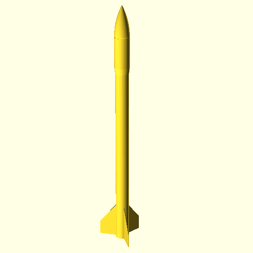
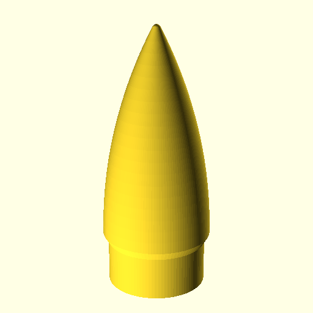
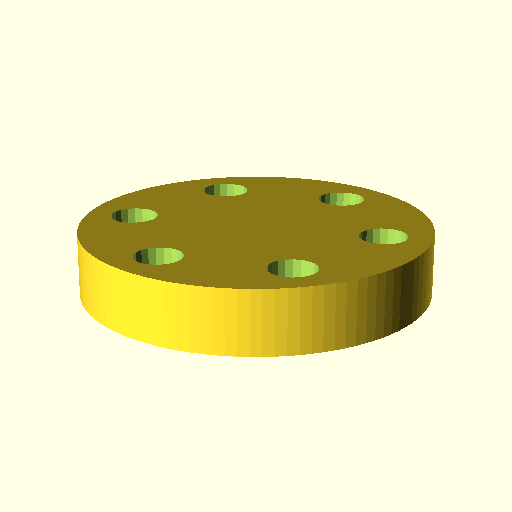
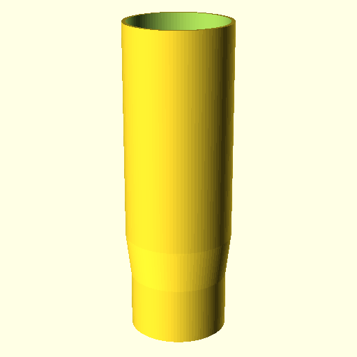
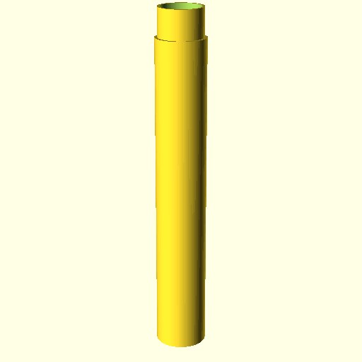
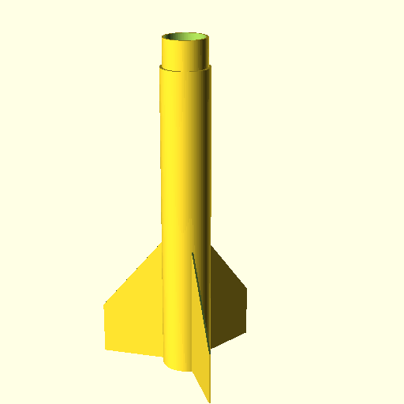

# EP-R1
* small 3D printed version of ***EP-R2*** rocket.
* created for testing and demonstration pruposes.
* designed for C6-3 rocket engine.

## 3D printed components

### Nosecone

### Parachute ring

### Container

### Hull

### Motor block
